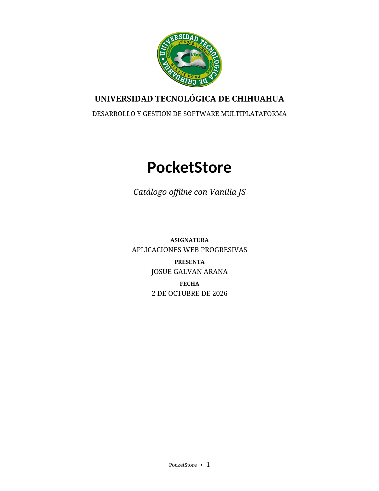
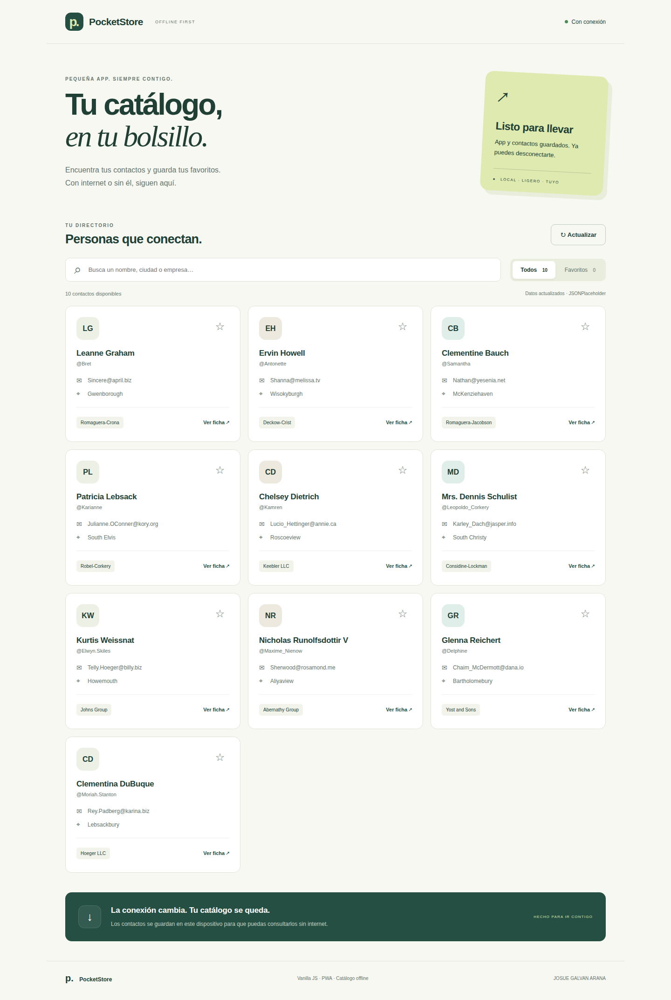
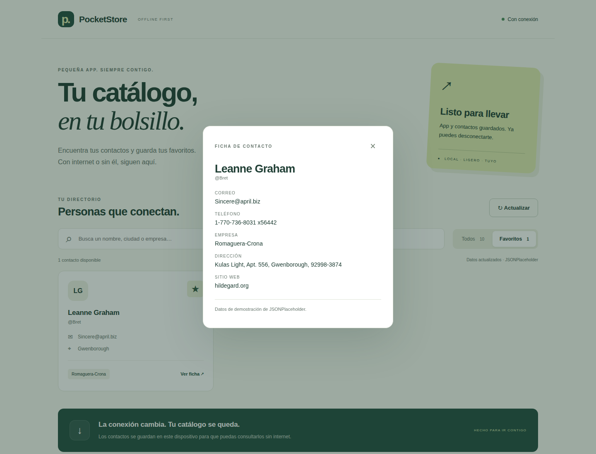
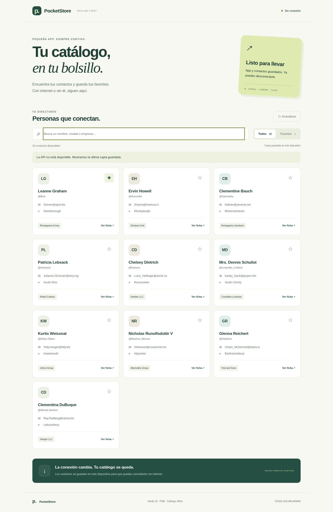
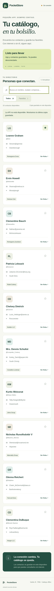

<p align="center"></p>

# PocketStore

Aplicación web de una sola página que permite consultar un catálogo de **10 usuarios**, buscar por nombre, correo, ciudad o empresa y guardar favoritos. Está hecha con HTML, CSS y JavaScript puro, sin frameworks ni recursos visuales externos. Una vez cargada y preparada la caché, se puede cerrar y volver a abrir sin internet.

**Autor:** JOSUE GALVAN ARANA  
**Asignatura:** Aplicaciones Web Progresivas  
**Modalidad:** Desarrollo individual  
**Repositorio:** https://github.com/Josue1855/PocketStore

## Iniciar la aplicación

Se requiere Python 3 para el servidor local. La aplicación en sí no requiere instalar dependencias.

```bash
cd /home/josuegalvan/Documentos/repos/PocketStore
python3 server.py
```

Abre **http://localhost:8000** en Chrome, Edge o Firefox. Para detener el servidor, presiona `Ctrl+C`. Si el puerto está ocupado, utiliza `python3 server.py --port 8001` y abre http://localhost:8001.

No abras `index.html` con doble clic: los Service Workers requieren **localhost o HTTPS**. Desde otra computadora, clona el repositorio, entra en su carpeta y ejecuta el mismo servidor.

## Funciones

- Catálogo de usuarios con nombre, correo, ciudad y empresa.
- Búsqueda sin distinguir mayúsculas ni acentos.
- Favoritos guardados mediante `localStorage` y disponibles sin conexión.
- Ficha con teléfono, dirección y sitio web, accesible también offline.
- Actualización manual y al recuperar la conexión.
- Indicador de conexión y de procedencia de los datos.
- Diseño adaptable a teléfonos, navegación con teclado y cierre de fichas con Escape.
- Instalación como PWA cuando el navegador ofrece esa función.

Los contactos son **datos ficticios de demostración** de [JSONPlaceholder](https://jsonplaceholder.typicode.com/). No existe un proceso de compra ni se almacenan contactos personales reales.

## Estructura del proyecto

```text
PocketStore/
├── index.html                 # Vista estática y App Shell
├── styles.css                 # Estilos locales y diseño adaptable
├── app.js                     # Fetch, búsqueda, favoritos y registro del SW
├── sw.js                      # Install, activate y fetch; cachés
├── manifest.json              # Nombre, inicio, colores e iconos de la PWA
├── data/
│   └── users.json             # Copia de demostración de la API
├── icons/
│   ├── icon-192.png
│   ├── icon-512.png
│   └── maskable-512.png
├── docs/
│   ├── Portada_PocketStore.docx
│   ├── Portada_PocketStore.pdf
│   ├── VALIDACION.md
│   └── images/                # Portada y capturas reales del proceso
├── tests/
│   └── offline.cjs            # Pruebas funcionales en navegador
├── server.py                  # Servidor local sin paquetes externos
├── package.json               # Dependencia opcional de pruebas
└── .gitignore
```

## Componentes de la consigna

### 1. Manifiesto

`manifest.json` se configura manualmente. Define `name`, `short_name`, `id`, `start_url`, `scope`, `display: "standalone"`, idioma español y colores corporativos. Los iconos locales tienen tamaños 192×192 y 512×512; un tercer icono de 512×512 es adaptable (`maskable`). Las rutas relativas permiten alojar la aplicación en una subcarpeta.

### 2. App Shell

`index.html` contiene la barra superior, título, contenedor principal, búsqueda, controles y pie de página. `styles.css` conserva ese marco visual mientras `app.js` carga el contenido dinámico. Se utilizan fuentes del sistema e iconos locales para evitar dependencias de internet. El script se carga con `defer` para permitir que aparezca primero la estructura estática.

### 3. Service Worker y caché

- **Install:** precarga la página, CSS, JavaScript, manifiesto, iconos y los datos de demostración. La instalación solo se completa si todos esos archivos se guardaron correctamente.
- **Activate:** elimina versiones anteriores de las cachés que empiezan por `pocketstore-` y toma control de las páginas dentro de su alcance. No elimina las cachés de otras aplicaciones del mismo dominio.
- **Fetch del App Shell:** aplica **cache first**. Sirve los archivos guardados inmediatamente; las navegaciones reciben `index.html`.
- **Fetch de usuarios:** aplica **network first**, con límite de cinco segundos. Verifica una respuesta HTTP correcta y la estructura de los datos antes de guardarlos. Si la red falla, utiliza la última respuesta válida; si todavía no existe, devuelve `data/users.json`, incluido desde la instalación.

Las cachés son `pocketstore-shell-v1` y `pocketstore-data-v1`. Cambia `VERSION` en `sw.js` al modificar los archivos precargados. El navegador comprobará la nueva versión cuando se vuelva a abrir la app con conexión. `skipWaiting()` y `clients.claim()` permiten utilizar el SW desde la primera visita tras instalarlo.

### 4. Contenido dinámico

`app.js` consume `https://jsonplaceholder.typicode.com/users` con `fetch()`. Presenta primero la copia local y posteriormente actualiza el catálogo con la respuesta de la API. El encabezado `X-PocketStore-Source`, agregado por el SW, permite distinguir los datos de red, la copia guardada y la demostración incluida. Los favoritos se guardan por ID, separados del catálogo.

Los valores de la API se insertan con `textContent`, sin interpretar HTML externo. Si `localStorage` está restringido, los favoritos funcionan durante la sesión y se informa que no se pudieron guardar.

## Comprobar el funcionamiento offline

1. Inicia el servidor y abre la aplicación con conexión.
2. Espera a ver **«App y contactos guardados. Ya puedes desconectarte.»**.
3. Marca una estrella, busca un contacto y abre su ficha.
4. En las herramientas del navegador, entra en **Network / Red** y selecciona **Offline / Sin conexión**. Mantén desactivada la opción de omitir el Service Worker.
5. Recarga la página. El catálogo debe conservar sus diez usuarios; el indicador debe mostrar **«Sin conexión»** y el botón Actualizar debe estar deshabilitado.
6. Consulta fichas, busca y revisa los favoritos. La estrella guardada debe seguir presente.
7. Recupera la conexión. Se intentará actualizar el catálogo automáticamente.

Para comprobar el SW, abre **Application → Service Workers**; para revisar los archivos, abre **Application → Cache Storage**. Si nunca se ha consultado la API o está caída, la app muestra claramente que utiliza los datos de demostración incluidos.

Una primera visita a un sitio remoto exige conexión para descargar sus archivos. Después de preparar la caché, no necesita internet. Borrar los datos del sitio o usar un perfil nuevo elimina esa copia y los favoritos. La persistencia está sujeta al almacenamiento disponible y a las políticas del navegador.

## Instalar

En Chrome o Edge, utiliza **Instalar app** cuando aparezca, o la opción de instalación del navegador. En iPhone o iPad, abre el sitio en Safari y usa **Compartir → Añadir a pantalla de inicio**. La presentación de la opción y los requisitos de instalación dependen del navegador. La instalación no es necesaria para consultar el catálogo offline.

## Evidencias del desarrollo

Las siguientes capturas provienen de la aplicación en funcionamiento y de sus pruebas, no de un diseño simulado.

### App Shell y contenido dinámico



### Interacción y ficha de contacto



### Recarga sin conexión



### Diseño para teléfono



## Pruebas automatizadas opcionales

Para repetir las pruebas se requiere Node.js y Playwright. Estas herramientas son únicamente para desarrollo; no forman parte de la aplicación.

```bash
npm install
npx playwright install chromium
```

Con el servidor activo en otra terminal:

```bash
npm test
```

Si usas otro puerto:

```bash
POCKETSTORE_URL=http://localhost:8001/ npm test
```

Las pruebas verifican carga, búsqueda, resultados vacíos, favoritos persistentes, fichas, teclado, recarga offline, reconexión, ancho móvil, manifiesto, iconos, caché y API no disponible. Consulta [VALIDACION.md](docs/VALIDACION.md) para el resultado de la ejecución de entrega.

## Publicación y entrega

La URL para entregar es **https://github.com/Josue1855/PocketStore**. El repositorio contiene todo el código, documentación, portada institucional y evidencias. Para publicar la app opcionalmente con GitHub Pages, selecciona la rama `main` y la carpeta raíz en **Settings → Pages**; HTTPS permite registrar el Service Worker. El repositorio y un sitio publicado son entregables distintos: no es necesario habilitar Pages para revisar el código.

## Referencias

- [JSONPlaceholder](https://jsonplaceholder.typicode.com/): API pública gratuita y fuente de los usuarios ficticios.
- [MDN: Service Worker API](https://developer.mozilla.org/en-US/docs/Web/API/Service_Worker_API).
- [MDN: Cache API](https://developer.mozilla.org/en-US/docs/Web/API/Cache).
- [MDN: Manifiesto de aplicaciones web](https://developer.mozilla.org/en-US/docs/Web/Progressive_web_apps/Manifest).
